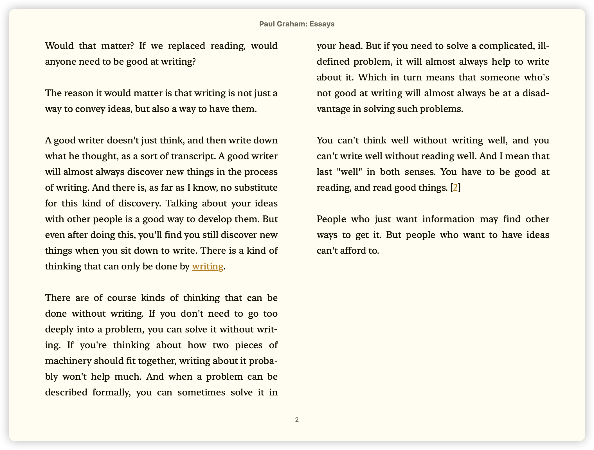
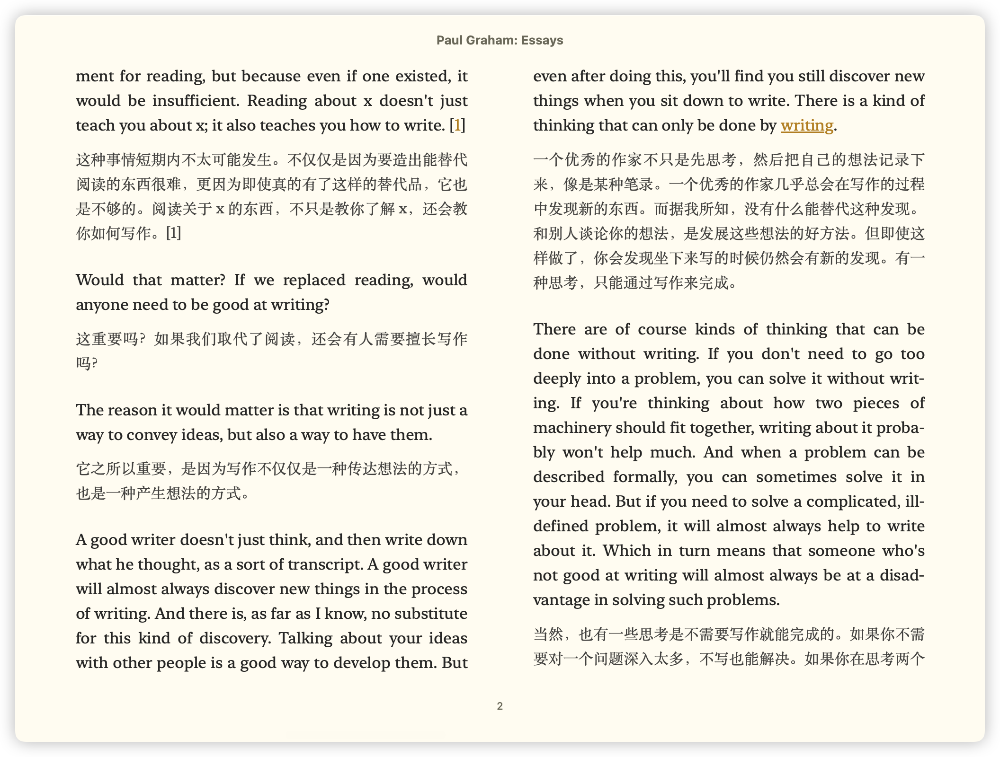

# BookCraft

BookCraft 是一个将「英文 EPUB/Markdown/PDF」一键翻译成「中英或仅中文 EPUB/Markdown」的 Skill。


## 功能

- **三格式支持**：EPUB / Markdown / 文本型 PDF（扫描版会提示先 OCR）
- **无需配置**：复用当前对话模型，逐段或并行子代理翻译，无需配置第三方 API Key
- **术语表统一译名**：自动提取全书专有名词候选（人名/地名/机构名），先翻译术语表再翻译正文，保证人名译名全书一致
- **富文本保留**：保留原文的链接、加粗、图片等 DOM 结构，对照排版美观
- **两种翻译类型**：`bilingual`（中英对照，默认）/ `chinese_only`（仅中文，标题保留英文）

## 效果展示

<table>
  <tr>
    <td align="center"><b>原版（英文）</b></td>
    <td align="center"><b>中英对照</b></td>
  </tr>
  <tr>
    <td></td>
    <td></td>
  </tr>
</table>

## 安装

### 1. 环境要求

- Python ≥ 3.9
- 一个支持 Skill 的 AI Agent 运行环境（如 Claude Code、Codex、OpenCode、Zcode 等）

### 2. 快捷安装（让 AI 助手代劳）

最省事的方式——把下面这句话发给你的 AI 助手，它会自动下载、安装并配置依赖：

> 请帮我安装 BookCraft 翻译工具：执行 `curl -fsSL https://raw.githubusercontent.com/pf711-dev/BookCraft-Skill/main/install.sh | bash`，完成后报告结果。

或者你自己跑一行命令（无需手动 clone）：

```bash
curl -fsSL https://raw.githubusercontent.com/pf711-dev/BookCraft-Skill/main/install.sh | bash
```

安装脚本会自动：复制 BookCraft 到 `~/.agents/skills/BookCraft` → 安装 Python 依赖 → 验证环境。

### 3. 手动安装

如果你想自己控制每一步：

1. 克隆仓库到 Agent 的 skills 目录：

   ```bash
   git clone https://github.com/pf711-dev/BookCraft-Skill.git ~/.agents/skills/BookCraft
   ```

2. 安装 Python 依赖：

   ```bash
   pip3 install -r ~/.agents/skills/BookCraft/requirements.txt
   ```

3. 首次使用时，Agent 会自动检查依赖是否就绪。

## 使用

安装完成后，直接在支持 Skill 的 AI 助手对话里发起翻译请求即可，无需手动调用脚本：

| 你说 | 行为 |
|------|------|
| 「翻译 book.epub」 | 执行完整翻译工作流 |
| 「把这个 Markdown 翻译成中文」 | 翻译 Markdown |
| 「翻译 book.epub，只要中文」 | 使用 `chinese_only` 类型 |

Agent 会自动：提取段落 → 翻译术语表 → 分批翻译正文 → 组装最终文件，并告知你输出路径。


### 手动术语表（可选）

若想固定某些人名/地名/机构名的译名，编辑用户术语表：

```bash
# 文件路径：~/.bookcraft/glossary.json
{
  "Elizabeth": "伊丽莎白",
  "William": "威廉"
}
```

翻译时会自动读取该文件，且**优先于自动生成的术语表**使用，保证全书一致。


## 边界

- 只翻译**英文 → 中文**，暂不支持其他语言
- 只处理 **EPUB、Markdown、文本型 PDF** 三种格式
- 翻译质量取决于驱动模型的翻译能力，不提供人工审校

## 许可证

[MIT](LICENSE)
